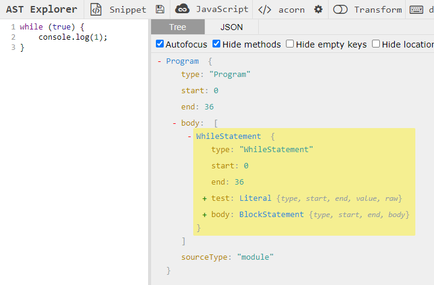

# 背景

本文旨在通过提取官方文档的关键内容，略去一些知识，快速了解插件的基本编写方式，方便你在较低学习成本下写出插件。

# 基础

Babel 是 JavaScript 编译器，更确切地说是源码到源码的编译器，通常也叫做“转换编译器（transpiler）”。 意思是说你为 Babel 提供一些 JavaScript 代码，Babel 更改这些代码，然后返回给你新生成的代码。

## 抽象语法树（ASTs）
这个处理过程中的每一步都涉及到创建或是操作抽象语法树，亦称 AST。

> Babel 使用一个基于 [ESTree](https://github.com/estree/estree) 并修改过的 AST，它的内核说明文档可以在[这里](https://github. com/babel/babel/blob/master/doc/ast/spec. md)找到。.

```js
function square(n) {
  return n * n;
}
```

这个程序可以被表示成如下的一棵树：

<!-- truncate -->

```
- FunctionDeclaration:
  - id:
    - Identifier:
      - name: square
  - params [1]
    - Identifier
      - name: n
  - body:
    - BlockStatement
      - body [1]
        - ReturnStatement
          - argument
            - BinaryExpression
              - operator: *
              - left
                - Identifier
                  - name: n
              - right
                - Identifier
                  - name: n
```

每一层结构也被叫做 节点（Node）。 一个 AST 可以由单一的节点或是成百上千个节点构成。 它们组合在一起可以描述用于静态分析的程序语法。

我们可以使用 [AST Explorer](https://astexplorer.net/) 来对 AST 节点有一个更好的认识，在后续插件的编写中，也可以通过它来准确遍历节点。

## Babel 的处理步骤

Babel 的三个主要处理步骤分别是： **解析（parse）**，**转换（transform）**，**生成（generate）**。.

### 解析

**解析**步骤接收代码并输出 AST。 这个步骤分为两个阶段：[**词法分析（Lexical Analysis） **](https://en.wikipedia.org/wiki/Lexical_analysis)和 [**语法分析（Syntactic Analysis）**](https://en.wikipedia.org/wiki/Parsing)。

### 转换

这里是插件介入工作的地方。
[转换](https://en.wikipedia.org/wiki/Program_transformation)步骤接收 AST 并对其进行遍历，在此过程中对节点进行添加、更新及移除等操作。 

### 生成

[代码生成](https://en.wikipedia.org/wiki/Code_generation_(compiler))步骤把经过一系列转换之后的 AST 转换成字符串形式的代码，同时还会创建[源码映射（source maps）](http://www.html5rocks.com/en/tutorials/developertools/sourcemaps/)。.

代码生成其实很简单：深度优先遍历整个 AST，然后构建可以表示转换后代码的字符串。

# 了解你在插件里要做的事情

以及Babel为了方便你编写插件，已经做的事情。

接下来，我们都会以一个具体的需求为例，方便理解插件要做的事情：

对于同步的循环（`for, for/in, for/of, while, do/while`）执行，期望增加一套检测程序，当循环陷入死循环时，及时抛出异常以终止循环，来避免程序崩溃。判断是否陷入死循环的方式是：增加迭代计数器，当计数到一个足够大的数时，便认为死循环。

如果我们直接在已有的一段代码上增加这段检测代码，应该是这样的，增加前：

```js
while (true) {
    console.log(1);
}
```

增加后：

```js
let iterator = 0;
while (true) {
    if(iterator++>9999999){
        throw new RangeError("Infinite loop: exceeded 9999999 iterations.");
    }
    console.log(1);
}
```

试想如果要编写插件，我们要做的事情：

1. 找到所有的循环语句
2. 在该段循环的父级作用域声明变量，如 `iterator`（变量名的前提是不能和已有的变量冲突），初始值为 0
3. 对于循环执行语句，如果不是块语句（大括号包裹起来的代码），需要修改为块语句
4. 在块语句开头，增加一段 if 语句，用于增加变量 `iterator` 的值，并判断`iterator` 是否已经超过设定的阈值（如9999999），如果是则抛出异常

借助Babel，我们希望可以快速达成这些事情：

1. 通过声明告诉 Babel，我们需要在特定的条件下（循环语句这样一个AST节点）处理代码
2. 对于节点的操作，可能包括节点本身的修改，也可能对节点的父节点进行访问，也可能是需要插入一个子节点。对此，Babel是通过路径 NodePath 来提供相应方法的，来表示节点之间的关联关系。一个 NodePath 对象主要有如下属性

    ```
    {
      "parent": Node,    // 父节点
      "node": Node,    // 当前的节点
      "parentPath": NodePath,    // 对于父节点，其对应的 path 对象
      "container": [...Node],    // 路径的容器（包含所有同级节点的数组）
      "scope": Scope,    // 作用域对象，后面会讲
    }
    ```

    同时 NodePath 对象还包含添加、更新、移动和删除节点有关的其他很多方法，以实现如修改为块语句这样的方法。
    
3. 在作用域中声明变量，需要让新增加的变量名字和已有的所有变量不冲突。
4. 对于新增的这段 if 语句，由 Babel ([babel-template](https://github.com/babel/babel/tree/master/packages/babel-template)) 提供编写字符串形式且带有占位符的代码来代替手动创建 AST。

# 了解 API

## 访问特定的语句

在插件代码中，先写下如下代码，即在模块中导出一个函数，函数返回的对象中，visitor 属性就是这个插件的主要访问者

```js
export default function() {
  return {
    visitor: {
      // visitor contents
    }
  };
};
```

如果要访问 while 循环的代码，我们可以在  [AST Explorer](https://astexplorer.net/) 中，查询其对应的 AST 节点名称，对于源代码：

```js
while (true) {
    console.log(1);
}
```
其 AST 形式如下：



我们便可以添加 `WhileStatement` 访问者方法：


```js
export default function() {
  return {
    visitor: {
      WhileStatement(path, state) {}
    }
  };
};
```

`visitor` 中的每个函数接收2个参数：`path` 和 `state`

* `path` 就是当前访问的 `NodePath` 对象
* `state` 是插件启动时传入的一些参数
```js
{
    cwd: '',    // process.cwd()
    file: File,
    filename: ’‘, // 当前处理的文件名称
    opts: {} // 接受用户可以指定的插件特定选项
}
```

opts 是用户引入当前插件时，传入的选项


```js
{
  plugins: [
    ["my-plugin", {
      "option1": true,
      "option2": false
    }]
  ]
}
```

如有必要，你还可以把方法名用 `|` 分割成 `Idenfifier |MemberExpression` 形式的字符串，把同一个函数应用到多种访问节点。.

也可以在访问者中使用别名（如[babel-types](https://github.com/babel/babel/tree/master/packages/babel-types/src/definitions)定义），如使用 `Loop` 表示所有循环语句：

```js
return {
    visitor: {
        'Loop': () => {}
    }
}
```


## 验证与创建节点

* 通过 `@babel/core` 导入 `types` 对象

```js
import { types as t } from '@babel/core';
types.isIdentifier(path.node)
```

* 通过 `babel-types` 导入

```js
import * as t from "babel-types";
types.isIdentifier(path.node)
```

* 插件导出函数的入参也有 `types` 对象

该模块是一个用于 AST 节点的 Lodash 式工具库， 它包含了构造、验证以及变换 AST 节点的方法。 该工具库包含考虑周到的工具方法，对编写处理AST逻辑非常有用。

完整的方法可参考 [babel-types API](https://babeljs.io/docs/en/babel-types)

### 验证节点

* 通过 `t.isX` 方法

```js
t.isBinaryExpression(maybeBinaryExpressionNode);
```
这个测试用来确保节点是一个二进制表达式，另外你也可以传入第二个参数来确保节点包含特定的属性和值。

```js
t.isBinaryExpression(maybeBinaryExpressionNode, { operator: "*" });
```

* 通过 `t.assert` 方法

这类方法会抛出异常而不是返回 true 或 false

```js
t.assertBinaryExpression(maybeBinaryExpressionNode, { operator: "*" });
```

* 在 NodePath 上同样可以访问到 `isX` 方法

```js
Identifier(path) {
  if (path.isIdentifier({ name: "n" })) {
    // ...
  }
}
```

相当于

```js
Identifier(path) {
  if (t.isIdentifier(path.node, { name: "n" })) {
    // ...
  }
}
```

### 创建节点

按类似下面的方式使用：

```js
t.binaryExpression("*", t.identifier("a"), t.identifier("b"));
```

可以创建如下所示的 AST：

```js
{
  type: "BinaryExpression",
  operator: "*",
  left: {
    type: "Identifier",
    name: "a"
  },
  right: {
    type: "Identifier",
    name: "b"
  }
}
```

当打印出来之后是这样的：

```
a * b
```

###  创建一个无冲突的变量名

需要访问 `scope` 来生成一个标识符，不会与任何本地定义的变量相冲突

```js
const node = path.scope.generateUidIdentifier("xxx");
```

其返回的是一个 `Identifier` 类型的 `Node`，然后可以将该变量名和初始化值，传给 scope，以在当前作用域创建变量的声明与初始化。

```js
path.scope.push({ id: node, init: t.numericLiteral(0) });
```

### 通过编写字符串生成节点

[@babel/template](https://github.com/babel/babel/tree/master/packages/babel-template) 能让你编写字符串形式且带有占位符的代码来代替手动编码， 尤其是生成的大规模 AST的时候。

在字符串中，你可以使用 语法占位符（例如%%name%%）或标识符占位符（例如NAME）（但不能混合使用）

随后，通过传入参数的方式来填充这些占位符。

```js
import { template, types as t } from '@babel/core';

const buildRequire = template(`
  var IMPORT_NAME = require(SOURCE);
`);

const ast = buildRequire({
  IMPORT_NAME: t.identifier("myModule"),
  SOURCE: t.stringLiteral("my-module")
});

```

如果不需要占位符，可以直接将字符串解析为 AST：

```js
const ast = template.ast(`
  var myModule = require("my-module");
`);
```

具体使用方式可查看[babel/template API](https://babeljs.io/docs/en/babel-template)

## 通过 NodePath 访问其他节点或path

### 获取父节点

```
path.parent
```

### 获取父节点的path

```
path.parentPath
```

### 获取子节点

需要根据具体的 AST 节点类型进行处理。例如，对于 `WhileStatement`，其 AST节点格式如下：

```json
{
      "type": "WhileStatement",
      "test": {
        "type": "Literal",
        "value": true,
        "raw": "true"
      },
      "body": {
        "type": "BlockStatement",
        "start": 13,
        "end": 36,
        "body": []
      }
    }
```

利用 `path.node[property]` 方法即可获取子节点，例如通过 `path.node.test` 访问到循环的条件表达式这一个节点，通过 `path.node.body` 访问到循环的执行语句。

### 获取子节点的Path

使用`path`对象的`get`方法，传递该属性的字符串形式作为参数。同上，例如通过 `path.get('test')` 访问到循环的条件表达式这一个节点，通过 `path.get('body.0')` 甚至可以进行多层的访问。

### 找到特定的祖先路径

有时你需要从一个路径向上遍历语法树，直到满足相应的条件。

对于每一个父路径调用`callback`并将其`NodePath`当作参数，当`callback`返回真值时，则将其`NodePath`返回。.

```
path.findParent((path) => path.isObjectExpression());
```

如果也需要遍历当前节点：

```
path.find((path) => path.isObjectExpression());
```

查找最接近的父函数或程序：

```
path.getFunctionParent();
```

向上遍历语法树，直到找到在列表中的父节点路径

```
path.getStatementParent();
```

### 获取同级路径

如果一个路径是在一个 `Function`／`Program` 中的列表里面，它就有同级节点。

使用 `path.container` 获取路径的容器（包含所有同级节点的数组）

## 通过 NodePath 修改节点

可以通过 [d.ts 文件](https://github.com/DefinitelyTyped/DefinitelyTyped/blob/master/types/babel-traverse/index.d.ts#L327) 了解所有的方法

### 替换一个节点

```js
path.replaceWith(
    t.binaryExpression("**", path.node.left, t.numberLiteral(2))
);
```

### 用多节点替换单节点

```js
path.replaceWithMultiple([...Nodes])
```

### 插入兄弟节点

```js
path.insertBefore(Node);
path.insertAfter(Node);
```
### 插入到容器（container）中

指的是对于函数语句，插入到其 `body` 的开头或结尾。

```js
path.get('body').unshiftContainer(Node);
path.get('body').pushContainer(Node);
```

# 编写代码

## 找到所有的循环语句

```js
export default () => {
    return {
        visitor: {
            'Loop': (
                path
            ) => {
            }
        }
    }
}
```

## 声明变量iterator


```js
export default () => {
    return {
        visitor: {
            'Loop': (
                path
            ) => {
                // An iterator that is incremented with each iteration
                const iterator = path.scope.parent.generateUidIdentifier('i');
                const iteratorInit = t.numericLiteral(0);
                path.scope.parent.push({
                    id: iterator,
                    init: iteratorInit,
                });
            }
        }
    }
}
```

相当于

```js
let iterator = 0;
while (true) {
    console.log(1);
}
```

## 增加iterator的判断语句

我们通过 `template` 实现。因为需要传入 iterator 这个变量名，需要使用占位符。

```js
const buildGuard = template(`
if (ITERATOR++ > MAX_ITERATIONS) {
    throw new RangeError(
        'Infinite loop: exceeded ' +
        MAX_ITERATIONS +
        ' iterations.'
    );
}`);

const guard = buildGuard({
    ITERATOR: iterator,
    MAX_ITERATIONS: t.numericLiteral(MAX_ITERATIONS)
});
```

随后是插入这段判断语句

```js
const { node } = path;
const { body } = node;
if (!t.isBlockStatement(body)) {
    path.get('body').replaceWith(t.blockStatement([guard, body]));
} else {
    path.get('body').unshiftContainer('body', guard);
}
```
