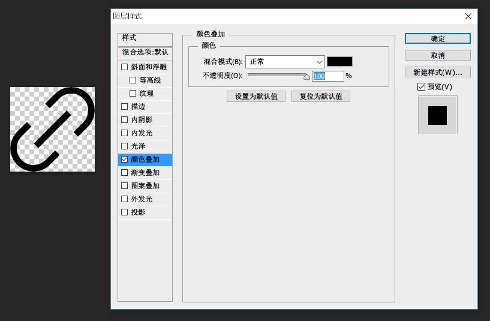
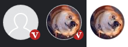

## 1. 用法 ##
-webkit-mask样式是利用该属性指定的图片作为遮罩，利用这张图像的透明度来显示位于该遮罩图下方的图像。如果遮罩图某个像素点透明度为1则显示下方的图像，透明度为0则不显示，介于0-1之间则呈现相应的透明度。
详情参考 [mask - CSS | MDN][1]
可以看到，mask的语法基本上拷贝自background，可以设置遮罩的url, position, repeat, size等属性，但不能直接设置颜色（纯色的遮罩意味着用opacity就能实现）。-webkit-mask-url可以设置gradients的渐变图片，也可以设置base64编码的图片。
## 2. 利用mask实现图标变色 ##
想让图标可以任意变色，常见的方案有：font-awesome, SVG等，甚至还有[drop-shadow][2]。其实可以利用background变色，而利用遮罩去绘制图标。遮罩透过的地方是图标的填色部分，而遮罩盖过的地方则没有颜色。
这种方法的优点就是转换成本极低，可以直接利用已有的图标PNG图。具体方法如下：

 - 将图标保存为PNG图，注意非图标区域应该是透明的。如果原有图标是sprite图，没关系，不用变，因为mask支持position属性。原先输出的图标不是纯黑色的？也没关系，因为mask样式只认你图片的透明通道

 - 设置图标的CSS，例如：

<!-- truncate -->

```css
.m-mask{
	width:141px;
	height:141px;
	-webkit-mask-image: url(mask.png);
	background: #3f51b5;
}
```
  
 - 这样就好了，效果如下


完全可以把此时的background-color理解成Photoshop中的颜色叠加



如果结合less sass，就可以做到自定义换肤了
## 3.利用mask修复圆角头像的毛边 ##
在实际的开发过程中，发现在较高版本的Chrome浏览器中，我们的圆角头像出现了无法容忍的毛边，定位到问题的原因是这样的：外层div利用background设置了垫底的默认图，设置了border-radius:50%。而内层的img为实际头像图，也设置了border-radius:50%。理论上两个相等大小、相同圆角的元素，也未设置任何定位，那么应该是头像完整盖着默认图。但实际并未如此，而是头像略小于默认图，因而出现了毛边。



因此我们可以为外层div添加一个样式
```
-webkit-mask-image: url('data:image/png;base64,iVBORw0KGgoAAAANSUhEUgAAAAEAAAABAQMAAAAl21bKAAAAA1BMVEUAAACnej3aAAAACklEQVQI12NgAAAAAgAB4iG8MwAAAABJRU5ErkJggg==')
```
url中设置的其实是1像素高宽的黑色图片，那么此时的遮罩就相当于外层div设置圆角区域后的一个不透明的圆形。此时就可以去掉img上的boder-radius了。最后效果如下，完美！


  [1]: https://developer.mozilla.org/en-US/docs/Web/CSS/mask
  [2]: http://www.zhangxinxu.com/wordpress/2016/06/png-icon-change-color-by-css/
