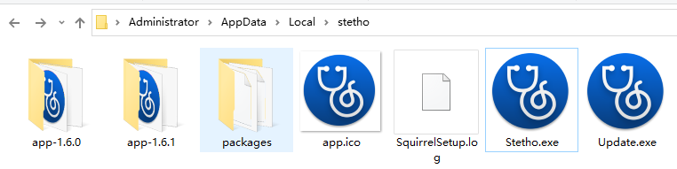
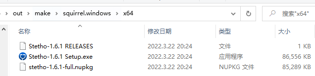

# Squirrel介绍

Electron的自动更新能力完全由Squirrel提供。我们先来了解下Squirrel能够提供怎样的更新能力：

## 在 Windows 上
Squirrel提供了应用程序从打包到安装、更新各阶段的能力。换一句话说，如果需要使用自动更新能力，那么应用程序的打包、安装也需要Squirrel的参与。

通过Squirrel打包的应用程序，在安装阶段，无需用户选择安装目录，也没有UAC对话框，应用将自动安装到`%USERPROFILE%\AppData\Local`目录下。

在更新阶段，无需用户做任何操作，Squirrel将在后台静默下载，待用户下次打开应用时就会替换为新的包。

出于后续自动更新的需要，应用的包文件，存放在以版本号命名的目录下。当有更新可用时，Squirrel下载新的包文件，采用同样的命名规则，存放在新目录下。应用的安装目录是这样的：



该目录下的`Stetho.exe`相当于启动引导，当运行该可执行文件时，将选择最新版本的包中的文件执行。

也正因为此，这个`%USERPROFILE%\AppData\Local\Stetho.exe`始终作为用户执行的入口，在第一次安装阶段，就建议以该可执行文件创建快捷方式（创建方法在下文有提到）。

<!-- truncate -->

## 在 MacOS 上

我们知道，在MacOS上，常规的应用程序（非AppStore）安装方式是打开`.dmg`文件，将应用直接拖入应用目录中。应用图标也能够自动在启动台等处出现。Squirrel打包的应用程序，在安装阶段不会有差异。在更新时，Squirrel将静默下载新包，在应用程序关闭后将执行自动安装。你也可用在更新下载完成后，提示用户有更新，确认后便会重启应用顺便更新一下。具体表现，同网易云音乐Mac端（[可以通过在官网下载体验](https://music.163.com/#/download)）类似。

# 在Electron应用中集成Squirrel
根据Electron的[文档](https://www.electronjs.org/zh/docs/latest/api/auto-updater/)，在 MacOS 上，无需做如何操作，已经内置Squirrel.Mac；在Windows中，就像前面说的，依赖于你的安装程序也要有Squirrel的参与，才能将Squirrel集成进来。而这个安装程序的生成，需要由你自己配置。像[electron-winstaller](https://github.com/electron/windows-installer), [electron-forge](https://github.com/electron-userland/electron-forge) 或者 [grunt-electron-installer](https://github.com/electron/grunt-electron-installer) 均可。

笔者使用的是 electron-forge，就支持[集成Squirrel到安装程序](https://www.electronforge.io/config/makers/squirrel.windows)中，更是支持将[一些配置](https://js.electronforge.io/maker/squirrel/interfaces/makersquirrelconfig)透传到Squirrel，以实现一些安装程序的定制，例如安装程序可执行文件（非应用启动时使用的可执行文件）的图标、文件名，甚至是loading动画。

# 在Electron应用中处理更新逻辑

借助Electron主进程中提供的[autoUpdater模块](https://www.electronjs.org/zh/docs/latest/api/auto-updater/)，我们不需要直接与Squirrel对接，抹平了Squirrel双端的差异，也不需要去看[Squirrel复杂的文档](https://github.com/Squirrel/Squirrel.Windows/tree/master/docs)。

在Electron主进程下，可以待app启动后，执行更新的检查（`autoUpdater.checkForUpdates()`）。在此之前，必须先设置检查更新的服务器地址（`autoUpdater.setFeedURL(options)`），对于服务器的搭建，下个章节将做介绍。

开发者可以自行设定条件（例如设定每1小时一次），重复进行检查更新。
当有可用更新，且Squirrel已完成更新的下载，将触发`'update-downloaded'`事件，此时可用提醒用户更新可用，马上执行安装，亦或是不做任何提醒，当用户下次打开应用后，更新也会生效。

在autoUpdater的文档中，已经介绍得比较清楚了，此处不再详述。读者亦可参考[Electron官方的示例文件](https://github.com/electron/update-electron-app/blob/master/index.js)。

# 搭建更新服务器

在[示例文件](https://github.com/electron/update-electron-app/blob/master/index.js)中，可以看到`feedURL` 的设置方式：

```js
const feedURL = `${host}/${repo}/${process.platform}-${process.arch}/${app.getVersion()}`
```

笔者推荐也是采用这种方式，将`platform`, `version`等通过path方式传递。原因很简单，Squirrel封装的更新请求方式如下：

```
GET ${feedURL}/?id=${appId}&localVersion=${version}&arch=${arch}
```

Query 中并没有 `platform`。

对于直接托管在GitHub的项目，可以直接使用 https://update.electronjs.org/ 服务搭建更新服务器。对于需要进行私有部署的，就要参考[这个服务的代码](https://github.com/electron/update.electronjs.org/blob/2f8bac21d9036a557824d34823fdd66fbb261da3/index.js)了。

直接访问update.electronjs.org示例应用的 API，可以发现API的格式。
https://update.electronjs.org/electron/electron-api-demos/win32/1.0.0
```json
{
  "name": "2.0.2",
  "notes": "Updated to Electron 4.0.1",
  "url": "https://github.com/electron/electron-api-demos/releases/download/v2.0.2/ElectronAPIDemosSetup.exe"
}
```
https://update.electronjs.org/electron/electron-api-demos/win32/1.0.0/RELEASES
```
612ABC1A6317213550284A508C98AB679690BA7C https://github.com/electron/electron-api-demos/releases/download/v2.0.2/electron-api-demos-2.0.2-full.nupkg 61704801
```

只需要按照这些格式实现 API 即可。

对于细节的处理，建议参考update.electronjs.org的实现，可能有诸如同`platform`，不同`arch`处理之类的逻辑。

## MacOS端

需要实现 `${feedURL}` 该API接口，响应JSON，包含以下几个属性：
```
pub_date: Date,
notes: string,
name: string,
url: string // 安装文件的地址
```

这些属性，将在 Electron 的 'update-downloaded' 事件中返回，供处理诸如弹窗的逻辑。也就是说，如果在你的应用中不需要，除了url，其他内容可以不返回。

## Windows 端

需要实现的是 `${feedURL}/RELEASES`，该接口返回 `RELEASES` 文件。该文件可以在打包的输出目录中找到（和安装程序exe，nupkg文件一起）



文件中引用了 `.nupkg` 文件的地址。该文件就是自动更新时下载的包文件。打包时该地址是相对路径，需要自行替换为完整的 CDN 地址。

```js
const res = await ctx.curl(releaseLink, {
    dataType: 'text',
});
text = res.data.replace(/[^ ]*\.nupkg/gim, nupkgLink);
```

## 全新下载

对于新用户，提供下载链接。此时 Windows 端提供`安装程序exe`文件，而不是`nupkg文件`。

# 在Squirrel.Windows安装阶段处理额外逻辑（创建快捷方式等）

在 Squirrel.Windows 的安装、卸载等不同阶段，将向你的应用程序传入不同的启动参数（[事件列表](https://github.com/Squirrel/Squirrel.Windows/blob/master/src/Update/Program.cs#L98)）。

你可以这么处理他们：

```js
var handleStartupEvent = function() {
  if (process.platform !== 'win32') {
    return false;
  }

  var squirrelCommand = process.argv[1];
  switch (squirrelCommand) {
    case '--squirrel-install':
    case '--squirrel-updated':

      // Optionally do things such as:
      //
      // - Install desktop and start menu shortcuts
      // - Add your .exe to the PATH
      // - Write to the registry for things like file associations and
      //   explorer context menus

      // Always quit when done
      app.quit();

      return true;
    case '--squirrel-uninstall':
      // Undo anything you did in the --squirrel-install and
      // --squirrel-updated handlers

      // Always quit when done
      app.quit();

      return true;
    case '--squirrel-obsolete':
      // This is called on the outgoing version of your app before
      // we update to the new version - it's the opposite of
      // --squirrel-updated
      app.quit();
      return true;
  }
};

```

像 [electron-squirrel-startup](https://www.npmjs.com/package/electron-squirrel-startup) 这样的包，实现了在这些不同阶段，对应用的快捷方式进行了管理。

当然，你也可以自己处理这些事件，可以实现诸如注册默认应用程序、注册 web Message等的管理，此处不再做介绍。

