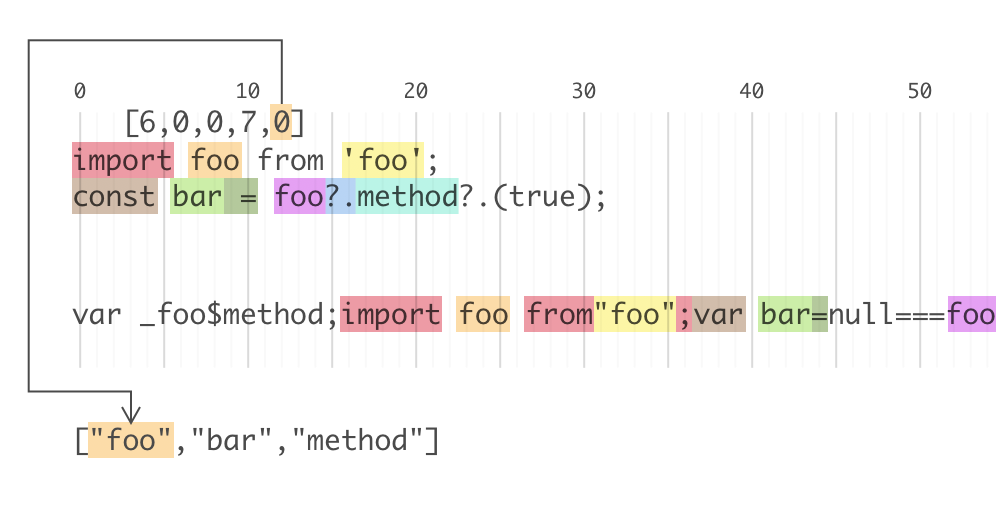

# 背景

之前都是借助浏览器直接使用SourceMap，只知道里面储存着位置信息，来将压缩混淆后的代码还原回压缩混淆前的代码，但对其具体格式并不了解。因为笔者近期在对NEJ打包脚本做升级，希望只保留NEJ对代码模块依赖分析的部分，对于代码编译引入Babel，对于代码混淆则引入UglifyJS 3的版本。因此必须对SourceMap格式做详细的了解，以实现SourceMap经过Babel，UglifyJS，文件合并后，依然能保持正确，实现代码的反混淆。

# 如何告知SourceMap文件地址

在JS文件底部，增加一行注释

```
//# sourceMappingURL=/path/to/file.js.map
```

或者设置特殊的 HTTP HEADER

```
SourceMap: /path/to/file.js.map
X-SourceMap: /path/to/file.js.map (deprecated)
```   

<!-- truncate -->

# SourceMap格式

```
{
    "version": 3,
    "sources": ["a.js", "b.js"],
    "names": ["foo", "bar"],
    "mappings": "gBAAA,MAAOA,IAAP,KAAgB,KAAhB,CACA,GAAMC,IAAG,QAAGD,GAAH,WAAGA,GAAH,sBAAGA,GAAG,CAAEE,MAAR,+BAAG,iBAAAF,GAAG,CAAf",
    "file": "out.js",
    "sourceRoot": "../src",
    "sourcesContent": ["...", "..."]
}
```

* names
    转换前的所有变量名和属性名，在mappings中，会使用这些名称在数组中的索引来进行查找。
* mappings
    记录位置信息的字符串，后面会继续介绍
* file
    (可选) 转换后的文件名称
* sourceRoot
   (可选) 转换前的文件所在的目录
* sources
    转换前的文件地址（相对于sourceRoot）。为数组，因为可能存在多个源文件合并为一个文件。
* sourcesContent
    (可选) 转换前的文件内容。即每一个源文件中源代码的内容。
    
    也就是说，如果未提供 `sourcesContent`，那么就需要基于 `sourceRoot` + `sources` 得到转换前的文件地址，通过访问源文件得到源代码的内容。
    
# mappings
    
笔者之前比较困惑的一点，怎么把混淆后的变量名和属性名，和 names 中列举的转换前的变量名和属性名一一对应起来。

其实这个位置信息是完全靠 mappings 来提供的。（即names中的顺序完全是可以和混淆后变量出现的顺序不同，在mappings中，会使用这些名称在数组中的索引来进行查找）至于为什么单独提供 names 而不是 mappings，完全是从节省文件大小的角度来设计的。

mappings不仅仅用于表示混淆前后的变量名和属性名映射关系，也是记录了混淆前后的位置对应关系。因为像Babel预编译等工具，会对源文件的语句做变更、插入新语句等的调整，工具本身也是在尽量将关联的编译前后的语句进行映射。

简而言之，mappings中每块信息，其实描述的是：

在转换后的代码第`m`行第`n`列，它在转换前的代码中是sources中的第`i`个文件的第`j`行第`k`列。如果它是变量名或属性名，转换前的名称是 names 中的第`x`个。即包含5个或6个数字（`x`可能没有）

`[m, n, i, j, k, [x]]`

而实际的mappings为了节省文件大小，有以下设计：

* 以分号（;）来区分转换后代码的不同行。即，第一个分号前的内容，就对应转换后代码的第一行，以此类推，第`m`个分号前的内容，对应转换后代码的第`m`行；
* 以逗号（,）分隔开的每一个内容，表示转换后代码的某处`位置`，采用VLQ编码。该内容在`,`相隔的文本在出现的顺序，与其在代码中的坐标信息无关。
* VLQ编码中存储了多个数字，用来表示剩余的`坐标`信息和对应的转换前的源码代码`坐标`等，按顺序应当分别为：转换后位于代码的第`n`列；在转换前的代码中是sources中的第`i`个文件；在转换前的代码中是第`j`行；在转换前的代码中是第`k`列；如果它是变量名或属性名，转换前的名称是 names 中的第`x`个。
* 对于转换后的代码第`n`列，转换前的代码中是sources中的第`i`个文件的第`j`行第`k`列，这几个`坐标`信息，在编码为VLQ前，还做了特殊处理，即这些`坐标`使用的是相对于上一个`位置`中这几个`坐标`的相对值。

至于 VLQ 编码的编码、解码方式，此处不做解析。

我们在实际阅读 mappings 时，可以借助 [https://www.murzwin.com/base64vlq.html](https://www.murzwin.com/base64vlq.html) 提供的工具进行转换。

以如下代码为例，转换前：
```js
import foo from 'foo';
const bar = foo?.method?.(true);
```

转换后：
```js
var _foo$method;import foo from"foo";var bar=null===foo||void 0===foo||null===(_foo$method=foo.method)||void 0===_foo$method?void 0:_foo$method.call(foo,!0);
```

SoureMap:
```json
{
    "names":["foo","bar","method"],
    "mappings":"gBAAA,MAAOA,IAAP,KAAgB,KAAhB,CACA,GAAMC,IAAG,QAAGD,GAAH,WAAGA,GAAH,sBAAGA,GAAG,CAAEE,MAAR,+BAAG,iBAAAF,GAAG,IAAf"
}
```

mappings 解码后的数据为：

每个方括号中内容分别为：转换后的代码第`n`列；转换前的代码中是sources中的第`i`个文件的第`j`行第`k`列；转换前的名称是 names 中的第`x`个

```js
[
    // 转换后的第0行
    [16,0,0,0],
    [6,0,0,7,0],
    [4,0,0,-7],
    [5,0,0,16],
    [5,0,0,-16],
    [1,0,1,0],
    [3,0,0,6,1],
    [4,0,0,3],
    [8,0,0,3,-1],
    [3,0,0,-3],
    [11,0,0,3,0],
    [3,0,0,-3],
    [22,0,0,3,0],
    [3,0,0,3],
    [1,0,0,2,2],
    [6,0,0,-8],
    [31,0,0,3],
    [17,0,0,0,-2],
    [3,0,0,3],
    [4,0,0,-15]
]
```

代码映射关系（局部）可见此图：



# 解析或生成 SourceMap

如笔者存在的对NEJ打包进行改造过程中，对源码分别使用 Babel，UglifyJS 进行了处理，最后做文件合并时，其实是需要将前面输出的 SourceMap 再做一个解析，然后根据文件合并时坐标信息的变换，修改SourceMap并输出新的文件。

[source-map](https://www.npmjs.com/package/source-map) 提供了对 SourceMap 解析、生成的能力，最主要的是将SourceMap中mappings这一难以阅读的VLQ编码进行解码、编码，提供其与转换前后的坐标信息的相互转换。

例如解析mappings：

```js
consumer.eachMapping(function (m) { console.log(m); })
// ...
// { source: 'illmatic.js',
//   generatedLine: 1,
//   generatedColumn: 0,
//   originalLine: 1,
//   originalColumn: 0,
//   name: null }
// { source: 'illmatic.js',
//   generatedLine: 2,
//   generatedColumn: 0,
//   originalLine: 2,
//   originalColumn: 0,
//   name: null }
// ...
```

